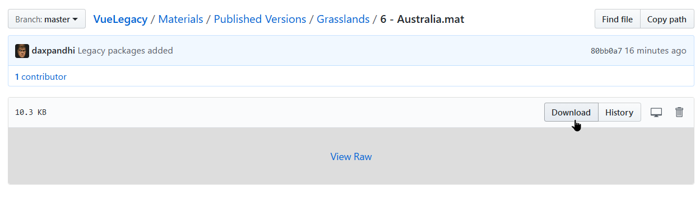
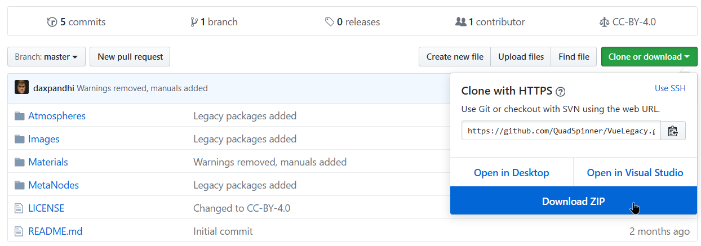
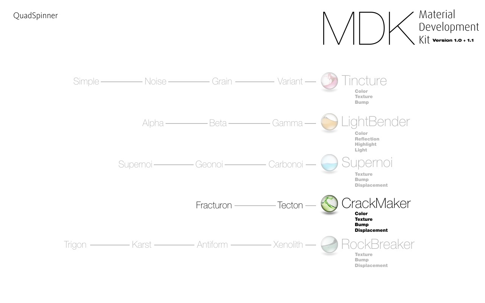
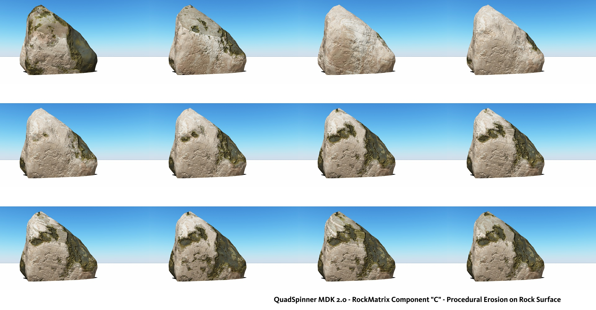

# QuadSpinner's Vue Legacy

The complete QuadSpinner Vue collection open-sourced for the public!

As a "thank you" to all the thousands of users who supported QuadSpinner in its infancy, we have open sourced our material, MetaNode, and function library under the [Creative Commons Attribution 4.0 International](license) license. You can use it for commercial use, modify and distribute the files as long as you link back to or attribute this repository.

# How to download
You can download individual files, or you can download the entire repository from this page.

# Development Versions
A special folder called "Development Versions" contains many materials from Dax Pandhi's private library that have been used in many different things, from Battlestar Galactica&reg; to God of War&reg;. Many of these are "half cooked" materials that are easily modified for various situations. Some of them are not "ready to use" and may require a bit of work, but you can learn many different techniques used in professional productions.

# Unlocked Versions
Most materials, functions graphs, and metanodes will be unlocked, or have an unlocked copy, so you can dig into it and find out how we created our bestselling materials.

# Contents
- MDK 1.1/1.0 (unlocked)
- MDK Elemental (unlocked)
- Arenite Warriors
- Dark Knights
- Dust in the Wind
- GeoAffinity
- Grasslands
- HyperTextures Vol 1
- Master Trinity
- Mineral Infinity
- Ice and Magma
- QS Rocks
- The Defenders / The Invasion

# Updates
This collection is not complete. We will keep adding to it over the next several weeks. To stay updated, click the "WATCH" button at the top of the page.

# Need help?
There are wonderful Vue communities (such as on Facebook) out there who will be able to help you! Unfortunately we cannot provide technical support or usage advice for these products.
